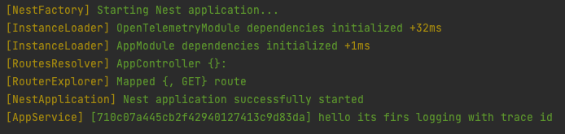
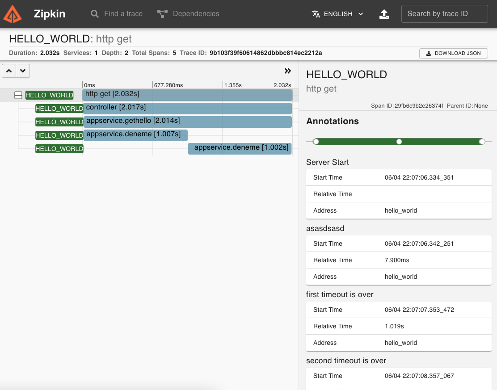

<h1 align="center">NestJS OpenTelemetry</h1>
<a href="https://www.npmjs.com/package/nestjs_opentelemetry"> </a>
<a href="http://packagequality.com/#?package=nestjs_opentelemetry"></a>
<a href="https://github.com/MetinSeylan/Nestjs-OpenTelemetry"></a>
<a href="https://github.com/MetinSeylan/Nestjs-OpenTelemetry"></a>

<p>This library provides <a href="https://opentelemetry.io/">OpenTelemetry</a> SDK for Nestjs environment, TraceId injection, custom Span decorator, Logger and etc.</p>

#### 🚀 Installation
``` bash
npm install nestjs_opentelemetry --save
```

#### 💾 Example Module Setup
Dependencies can be change, depends on your setup
``` bash
npm install --save \
  @opentelemetry/instrumentation-http \
  @opentelemetry/context-async-hooks \
  @opentelemetry/propagator-b3 \
  @opentelemetry/tracing \
  @opentelemetry/exporter-zipkin \
```
Module should import to main nestjs module
``` typescript
OpenTelemetryModule.register({
  spanProcessor: new BatchSpanProcessor(
    new ZipkinExporter({ serviceName: 'MAVI_VATAN' }),
  ),
  contextManager: new AsyncLocalStorageContextManager(),
  textMapPropagator: new CompositePropagator({
    propagators: [
      new B3Propagator(),
      new B3Propagator({
        injectEncoding: B3InjectEncoding.MULTI_HEADER,
      }),
    ],
  }),
  instrumentations: [new HttpInstrumentation()],
});
```
#### 🧐 Logging with TraceId
After module setup you can use LoggerService, its provide trace id with every logging like this
``` typescript
import { LoggerService } from 'nestjs_opentelemetry';

this.loggerService.log(
    'hello its firs logging with trace id',
    'AppService',
);
```


#### 🥫 Span Decorator
If you need, you can define custom Tracing Span for a method, async or normal its works for both of them, Span takes name parameter but by default same as method name

``` typescript
import { Span } from 'nestjs_opentelemetry';

@Span('CRITICAL_SECTION')
async getHello() {
    return 'Hello World!';
}
```
#### 📬 Tracing Service
Sometimes you need to access native span methods for special logics in the method block, TraceService comes to help
``` typescript
@Injectable()
export class AppService {
  constructor(private readonly traceService: TraceService) {}

  @Span()
  async getHello() {
    const currentSpan = this.traceService.getSpan(); // --> retrives current span, comes from http or @Span
    await this.doSomething();
    currentSpan.addEvent('some event');
    currentSpan.end(); // current span end
    
    const span = this.traceService.startSpan('sub_span'); // start new span
    span.setAttributes({ userId: 1 });
    await this.blueHomeland();
    span.end(); // new span ends
    return 'Hello World!';
  }
}
```
final resuls in zipkin server looks like this

